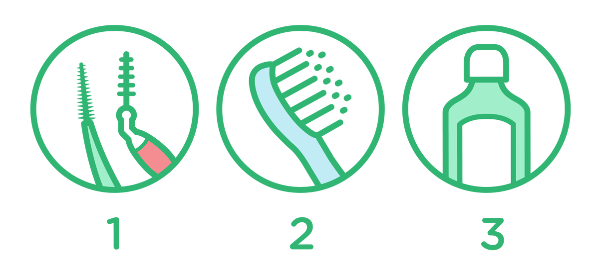

# Dentin Sensitivity in Patients: Facts, Stats, New Research

**Dentin Hypersensitivity** has been defined as "pain derived from exposed dentin in response to chemical, thermal, tactile or osmotic stimuli which cannot be explained as arising from any other dental defect or disease" [[1]](https://www.ncbi.nlm.nih.gov/pmc/articles/PMC3927677/).

---

Often diagnosed as dentin hypersensitivity, tooth sensitivity continues to be one of the most vocal concerns of dental patients. They often complain of pain when eating or drinking hot or cold foods, or report sensitivity when breathing through their mouth. It affects individuals of all ages and health considerations - even those with otherwise perfect teeth.

According to recent research, the [**prevalence of dentin hypersensitivity among adults may be as high as 11.5 percent** [2]](https://www.sciencedirect.com/science/article/pii/S0300571218305736), and maybe even higher when we factor in undiagnosed cases. Because pain is subjective and each person is unique, there are [**management techniques and products** [3]](https://www.ncbi.nlm.nih.gov/pmc/articles/PMC3010026/) specifically targeted at individuals with sensitive teeth. We'll explore the current state of tooth sensitivity facts, stats and new research below.

## Dentin sensitivity symptoms

Getting to the root of tooth sensitivity issues can be a challenge for dental professionals. Patients might complain of sensitivity when discussing oral health concerns, or there may be signs during a cleaning that prompt the hygienist to probe questions about sensitive teeth. Common symptoms generally include:

- Spontaneous tooth pain
- Sensitivity localized to one tooth or several adjacent teeth
- Sharp pain when exposed to hot and cold, such as cold air or ice cream
- Pain when biting or chewing
- Aversion to alcohol-based rinses
- Pain when breathing through teeth

---

---

## Diagnosing dentin hypersensitivity

Against any of these symptoms, any level of sensitivity needs investigation, using a classic pain scale like a VAS (visual analog scale). A hygienist/dentist can perform spot checks on sensitive teeth during the consultation or during cleaning. In any case, exposed dentin needs to be noted in patient charts and incorporated into an ongoing hygiene and care regimen.

The dental professional will also need to pose a differential diagnosis to differentiate the pain caused by dentin hypersensitivity from other types of pain caused by pulpitis, fracture, inadequate restorations, or bleaching, for example. Clinical and radiographic exams with diagnostic tests (like palpation, vitality test, transillumination, occlusal control, control of restorations, etc.) may be helpful in excluding the other [hypotheses](https://pmc.ncbi.nlm.nih.gov/articles/PMC7409672/). Differential diagnosis and determination of the etiology are fundamental in the choice of treatment and in its success.

A study of [**effective management of sensitive teeth** [4]](https://link.springer.com/article/10.1186/s12903-017-0334-0) published in 2017 explores effective methods of diagnosing and qualifying sensitivity. Results from the study conclude that a multifaceted approach to diagnosis is best in distinguishing sensitivity from hypersensitivity. Ninety-nine percent of dentists used a combination of the following methods:

- Clinical examination (48%)
- Applying an air blast (26%)
- Applying cold water (12%)
- Patient oral reporting after dentist's query (6%)

## Causes of Tooth Sensitivity and Dentin Hypersensitivity

Following qualification of tooth sensitivity, the [**same study** [5]](https://link.springer.com/article/10.1186/s12903-017-0334-0) examined factors of predisposition, the top three of which were:

- Gingival recession - 66%
- Abrasion, erosion, abfraction/attrition lesions - 59%
- Bruxism - 32%

Symptoms typically emerge as a result of the wear or loss of the enamel exposing the dentinal tubules. It's the movement of fluid inside the tubules, provoked by heat or cold or other stimuli, that creates osmotic stimuli that are transmitted to the pulpal nerves provoking the pain. [**This hydrodynamic theory** [6]](https://www.ncbi.nlm.nih.gov/pmc/articles/PMC3927677/) is the most pervasive one.

- Gingival recession or more generalized periodontitis, even when treated, can lead to root exposure: the cement, which is more fragile than the enamel, will wear off quickly, thus exposing the underlying dentin.
- Reasons for damaged or diminished enamel due to attrition, abrasion, erosion and abfraction, exposing the dentinal tubules can include inappropriate brushing technique (horizontal brushing, excessive pressure) or tools (medium or hard bristles of the toothbrush or abrasive toothpaste). Non-Carious Cervical Lesions (NCCL) can then appear at the cervical buccal area: these NCCLs have a worn-off and smooth aspect, and can be shallow or very deep (like a wedge toward the dentin). They can be brownish because of the reactionary dentin. Aside from the esthetic impairment, they can be very sensitive.

---

---

Acidic food or beverages can also cause enamel wear. Discuss cleaning and dietary habits with patients to uncover possible causes. Sometimes a simple measure could be helpful, like recommending the patient to rinse with water after an acidic intake. In fact, one [**2012 study** [7]](https://www.researchgate.net/publication/235626943_Dental_erosion_as_oral_disease_Insights_in_etiological_factors_and_pathomechanisms_and_current_strategies_for_prevention_and_therapy) shows that monitoring acidic food intake and maintaining a solid oral routine can be effective in dealing with enamel wear due to diet.

Sometimes, the acidic attack can be linked to another more general disease like bulimia or other eating disorders, as vomiting on purpose can put the teeth in contact with acidic gastric liquid. These erosive lesions uncovering the dentin are however mostly on the palatal side of the teeth. It is thus important to investigate the patient's medical conditions as well as the patient's behavioral, dietary and brushing habits.

- Bruxism provokes wear of the enamel by excessive and often involuntary grinding, clenching or thrusting of teeth, so rather on the occlusal aspect of them. In severe bruxism cases, the crowning of flattened teeth to protect the pulp may be necessary. Because of the heavy occlusal load and forces, it can also be [**responsible for abfraction lesions** [8]](https://www.ncbi.nlm.nih.gov/pmc/articles/PMC5026093/), which is where cervical enamel and dentin "breakaway" under tooth flexure, thus provoking dentin hypersensitivity.

Because tooth sensitivity continues to be such a pervasive and widespread issue for patients, research into effective management is ongoing. In the past five years, several clinical trials and new studies have served to broaden our understanding of not only tooth sensitivity, but also the most effective ways of managing and alleviating it.

## Treatments for dentin sensitivity

The most common treatments for general tooth sensitivity and dentin hypersensitivity are at-home remedies. Typically, it involves incorporating one or more of the following into a daily oral care regimen:

- Re-evaluation of proper brushing techniques and tools: the roll technique for example, and a soft-bristled toothbrush
- Desensitizing agents in prescription toothpaste and in alcohol-free rinses (high in fluoride or other molecules like potassium or strontium, by desensitizing or occluding the dentinal tubules)

Through proper brushing and the use of over-the-counter products, most patients with tooth sensitivity see a reduction in the level of sensitivity, if not complete resolution.

For those with more severe dentin hypersensitivity, additional chairside procedures may be required. These include fluorinated guards, bonding and sealing of sensitive areas (adhesives, fluoride varnishes). There are also emerging studies surrounding the use of remineralization agents as part of ongoing management plans for sensitive teeth. [**One such study produced in 2020** [9]](https://www.jstage.jst.go.jp/article/dmj/advpub/0/advpub_2019-325/_article/-char/ja/) indeed demonstrates that casein phosphopeptide-amorphous calcium (CPP-ACP) enhances remineralization. Incidentally, it also shows that CPP-ACP has antimicrobial properties and reduces the bacterial biofilm by as much as 39 percent by inhibiting bad bacteria (*S. mutans*) while promoting good bacteria (*S. gordonii*).

In deeper lesions and non-subsiding dental hypersensitivity, filling with a glass ionomer or composite resin, or even mucogingival surgery (like the coronally advanced flap and/or connective tissue graft in case of gingival recessions) may be needed.

Today, we know more than ever about why tooth sensitivity occurs, what effects it has on oral health and how to treat it - even as new information continues to emerge.

---

---

## Tips and scripts for patient education

As always, the key to helping patients overcome tooth sensitivity and any underlying catalysts is education. Patients need to understand when tooth sensitivity is normal and when it's a concern. It's up to dental professionals to provide patients with individualized information about their unique sensitivity.

Is it localized to one or two teeth, or is it a broad concern? What's the specific catalyst behind their sensitivity? Gingivitis? Periodontitis? Bruxism? Cracked tooth? Contextualize sensitivity for each patient before recommending solutions.

Lean on current research when offering a recommendation. Provide clear, actionable, informative resources for patient information. These should be consumer-facing resources like the following:

- [**Sensitive Teeth Causes and Treatments**](https://jada.ada.org/article/S0002-8177(14)65480-5/fulltext), from the American Dental Administration
- [**What causes sensitive teeth, and how can I treat them?**](https://www.mayoclinic.org/healthy-lifestyle/adult-health/expert-answers/sensitive-teeth/faq-20057854), from the Mayo Clinic
- [**Information About Sensitive Teeth**](https://www.dentalhealth.org/sensitive-teeth), from the Oral Health Foundation
- **Sensitive Teeth**, from GUM®

For patients seeking products that can provide relief, consider recommending our [**GUM SensiVital® + Toothpaste**](/en-en/products/toothpastes/gum-sensivital-plus-toothpaste.html) or [**GUM SensiVital Mouthwash**](/en-en/products/mouthwashes/gum-sensivital-plus-mouthwash.html). Data from a user experience survey shows that 86% of people using the mouthwash report long term alleviation from tooth sensitivity, and 70% of people who tried the toothpaste report immediate alleviation from tooth sensitivity (*SUNSTAR internal report, data on file*).

As tooth sensitivity continues to be a top concern among patients and their dentists, staying current on emerging research and information is paramount. Continue to check back with us for more information and up-to-date resources on sensitive teeth, dentin hypersensitivity, and the products and practices used to manage them.

---

## Related Articles

| Cards Article |  |  |
|---|---|---|
|  | **[Effective Strategies for Plaque Removal: Insights from Professor Filippo Graziani](/en-en/news-events/plaque-removal-lets-talk-oral-health.html)** | Professor Filippo Graziani shares insights into effective strategies for plaque removal and its role in preventing periodontal and peri-implant diseases. |
|  | **[Oral Health and Overall Health: Their Impact on Each Other](/en-en/news-events/systemic-health-lets-talk-oral-health.html)** | Professor Maria Clotilde Carra dives into the oral-systemic link as a key pillar for preventing periodontal and peri-implant diseases. |
