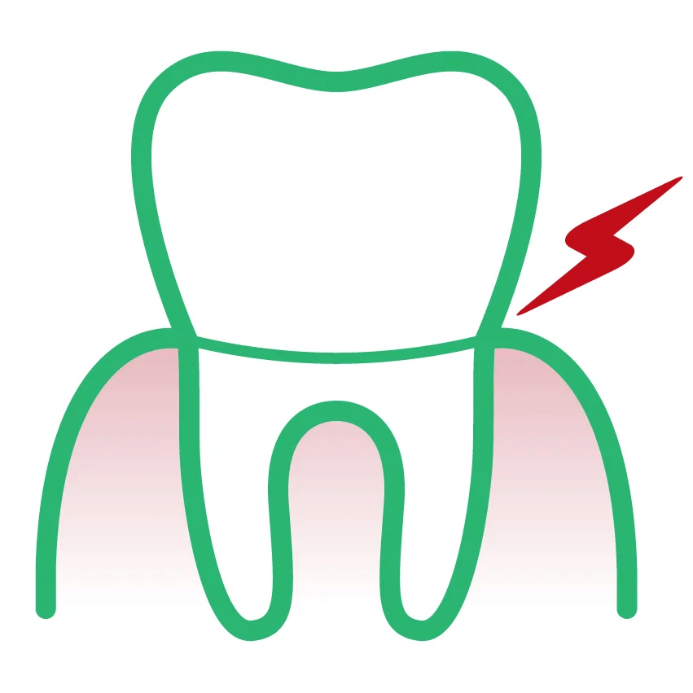

# Authoring Analysis

## Decision Framework: Default Content vs. Blocks

Following David's Model: "How would an author in Word/Google Docs create this?"

## Section-by-Section Authoring Decisions

### Section 1: Header
**Decision**: Use **header fragment**
**Rationale**: Global site component, reusable across all pages. Already exists as fragment.

---

### Section 2: Breadcrumb
**Decision**: **Default content**
**Rationale**: Simple text links. Author would just type "Home > Articles" as text with hyperlinks.
**Authoring**:
```
[Home](#) > [Articles](/en-en/news-events.html)
```

---

### Section 3: Article Header/Hero
**Decision**: **Default content** (no hero block needed)
**Rationale**: Author would simply:
1. Add metadata: date, reading time
2. Type the H1 title
3. Type the lead paragraph
4. Insert the hero image

**Authoring**:
```
---
publish-date: 2025-10-30
reading-time: 7
---

# Dentin Sensitivity in Patients: Facts, Stats, New Research

**Dentin Hypersensitivity** has been defined as "pain derived from exposed dentin..."


```

---

### Section 4: Article Content with Sidebar

#### Sidebar Table of Contents
**Decision**: **Section metadata** (style: two-column-with-toc)
**Rationale**: The TOC is navigation, not content. In EDS, this should be handled via section metadata that triggers CSS styling to create a two-column layout with automatic TOC generation from H2 tags.

**Alternative approach**: If auto-generation isn't available, could be a **toc block**, but section metadata is preferred.

#### Main Article Body
**Decision**: **Default content**
**Rationale**: Author would naturally write this as:
- Paragraphs of text
- H2 headings for each section
- Bullet lists
- Centered images with captions
- Links within text

This is exactly what Word/Google Docs is designed for. No special block needed.

**Authoring approach**:
- Use standard markdown: H2, paragraphs, lists, links, images
- Use `---` horizontal rules for visual separators
- Center images with CSS or simple markdown conventions

**Example**:
```markdown
Often diagnosed as dentin hypersensitivity, tooth sensitivity continues to be one of the most vocal concerns...

According to recent research, the **prevalence of dentin hypersensitivity among adults may be as high as 11.5 percent**...

## Dentin sensitivity symptoms

Getting to the root of tooth sensitivity issues can be a challenge...

- Spontaneous tooth pain
- Sensitivity localized to one tooth or several adjacent teeth
- Sharp pain when exposed to hot and cold
- Pain when biting or chewing

---



---

## Diagnosing dentin hypersensitivity

Against any of these symptoms, any level of sensitivity needs investigation...
```

---

### Section 5: Topics/Tags
**Decision**: **Default content** OR **section metadata**
**Rationale**: Simple tag link. Could be:
- Plain link: `[#Sensitive Teeth](/en-en/news-events.html?topic=Sensitive%20Teeth)`
- OR metadata: `tags: Sensitive Teeth`

**Recommendation**: Use metadata approach for cleaner authoring:
```
---
tags: Sensitive Teeth
---
```

---

### Section 6: Related Articles
**Decision**: **cards-article block** (with carousel variant)
**Rationale**: This is NOT something an author would naturally create in Word/Google Docs. It's a dynamic component showing:
- Grid/carousel of article cards
- Images, titles, descriptions
- Links to other articles
- Possibly automated (query-based) or manual

This requires a block for proper functionality and styling.

**Authoring**:
```markdown
## Related Articles

| Cards Article |
|---|
|  |
| Educate Patients on Proper Gum Care for Diabetes Control |
| The benefits of oral hygiene go beyond tooth and gum health... |
| /en-en/news-events/advising-patients-on-links-between-diabetes-and-periodontitis.html |
|  |
| Chlorhexidine, the Gold Standard in Dentistry, Mode of Action |
| Chlorhexidine is one of the main antibacterial ingredients... |
| /en-en/news-events/chlorhexidine-the-gold-standard-in-dentistry.html |
| ... (2 more cards) |
```

**Block variant considerations**:
- Need to check existing cards-article variants
- This carousel-style related articles section may need its own variant
- Variant name: possibly `cards-article-carousel` or `cards-article-related`

---

### Section 7: Footer
**Decision**: Use **footer fragment**
**Rationale**: Global site component, reusable across all pages. Already exists as fragment.

---

## Summary: Content Structure

### Sections and Content Types

| Section | Content Type | Block/Default | Notes |
|---------|--------------|---------------|-------|
| 1. Header | Fragment | header fragment | Reusable global component |
| 2. Breadcrumb | Default content | N/A | Simple text links |
| 3. Article header | Default content | N/A | H1, lead text, hero image |
| 4a. TOC Sidebar | Section metadata | N/A | `style: two-column-with-toc` |
| 4b. Article body | Default content | N/A | Text, H2s, lists, images, links |
| 5. Topics/Tags | Metadata | N/A | `tags: Sensitive Teeth` |
| 6. Related articles | Block | **cards-article** | Needs variant management |
| 7. Footer | Fragment | footer fragment | Reusable global component |

### Key Authoring Principles Applied

1. **Default content first**: The bulk of the article (95% of content) is standard markdown
2. **Blocks for dynamic components**: Only the related articles section needs a block
3. **Fragments for global elements**: Header and footer reused across site
4. **Metadata for structure**: Section styling, tags, date/time
5. **Natural authoring flow**: Author writes article like a document, not like building components

### Next Step: Block Variant Management

Need to:
1. Scan existing **cards-article** variants in the project
2. Check similarity with the related articles section design
3. Determine if existing variant can be reused OR new variant needed
4. Name convention: `cards-article-[variant]`
